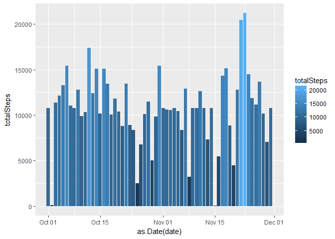

# Reproducible Research: Peer Assessment 1


## Loading and preprocessing the data


```r
library(dplyr)
library(ggplot2)

if (!exists("activityData")) {
  activityData <- read.csv("activity/activity.csv")
}
```

Helper function to be used later for plotting


```r
histStepsByDay <- function(data) {
  stepsTakenByDay <- data %>%
    group_by(date) %>%
    summarize(preTotalSteps = sum(steps)) %>%
    mutate(totalSteps = ifelse(is.na(preTotalSteps), 0, preTotalSteps))
  
  g <- ggplot(stepsTakenByDay, aes(x=as.Date(date), y=totalSteps, fill=totalSteps)) + geom_histogram(stat="identity")
  
  print(g)
  return(list(mean(stepsTakenByDay$totalSteps), median(stepsTakenByDay$totalSteps)))
}
```

## What is mean total number of steps taken per day?


```r
activityResults <- histStepsByDay(activityData)
```

<!-- -->

```r
meanStepsTakenByDay <- activityResults[1] 
medianStepsTakenByDay <- activityResults[2]
```

Mean steps taken each day: 9354

Median steps taken each day: 10395

## What is the average daily activity pattern?


```r
# q3
daysInExperiment <- length(unique(activityData$date))
stepsTakenByInterval <- activityData %>%
  mutate(zeroIfNa = ifelse(is.na(steps), 0, steps)) %>%
  group_by(interval) %>%
  summarize(steps = sum(zeroIfNa) / daysInExperiment)

g <- ggplot(stepsTakenByInterval, aes(x = interval, y = steps)) + geom_line()
print(g)
```

<!-- -->


```r
maxIndex <- which.max(stepsTakenByInterval$steps)
maxInterval <- stepsTakenByInterval[[maxIndex,1]]
maxIntervalSteps <- stepsTakenByInterval[[maxIndex,2]]
```

The 5 minute interval on average across all days with the maximum number of steps is 835 with 179 steps

## Imputing missing values


```r
validRows <- activityData %>% filter(!is.na(steps))
meanStepsTakenByInterval <- mean(validRows$steps)
medianStepsTakenByInterval <- median(validRows$steps)

# q4
# "impute" activityData by replacing NAs with mean steps taken each interval
activityDataRevised <- activityData %>%
  mutate(steps = ifelse(is.na(steps), meanStepsTakenByInterval, steps))

activityResultsRevised <- histStepsByDay(activityDataRevised)
```

<!-- -->

```r
meanStepsTakenByDayRevised <- activityResultsRevised[1] 
medianStepsTakenByDayRevised <- activityResultsRevised[2]
```

Number of rows with NA steps: 2304

Our imputation strategy here was naive: if data was missing, we simply fill it in with the mean steps taken per interval. This will increase both the mean and median of steps taken by day.

Mean steps taken by day after imputation: 10766

Median steps taken by day after imputation: 10766

## Are there differences in activity patterns between weekdays and weekends?

Weekends seem to be more "active" compared to weekdays


```r
stepsTakenPattern <- activityData %>%
  mutate(zeroIfNa = ifelse(is.na(steps), 0, steps), day=weekdays(as.Date(date))) %>%
  mutate(dayType = ifelse((day == "Saturday" | day == "Sunday"), "weekend", "weekday")) %>%
  group_by(dayType, interval) %>%
  summarize(steps = sum(zeroIfNa) / daysInExperiment)

stepsTakenPatternPlot <- ggplot(stepsTakenPattern, aes(x = interval, y = steps)) +
  geom_line() +
  facet_grid(dayType ~ .) +
  labs(y = "Number of steps", x = "Intervals") +
  theme_bw() +
  theme(
    panel.grid.major = element_blank(),
    panel.grid.minor = element_blank()
  )

print(stepsTakenPatternPlot)
```

<!-- -->
